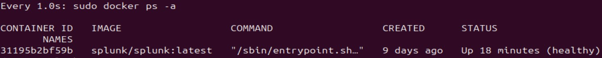
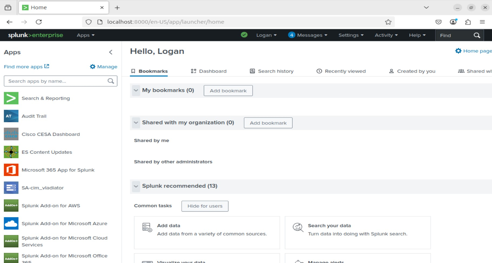
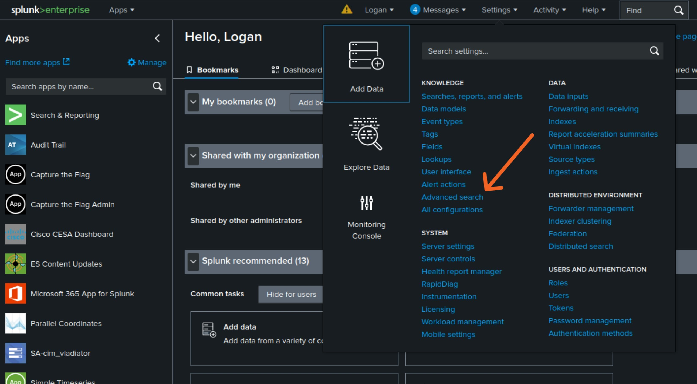
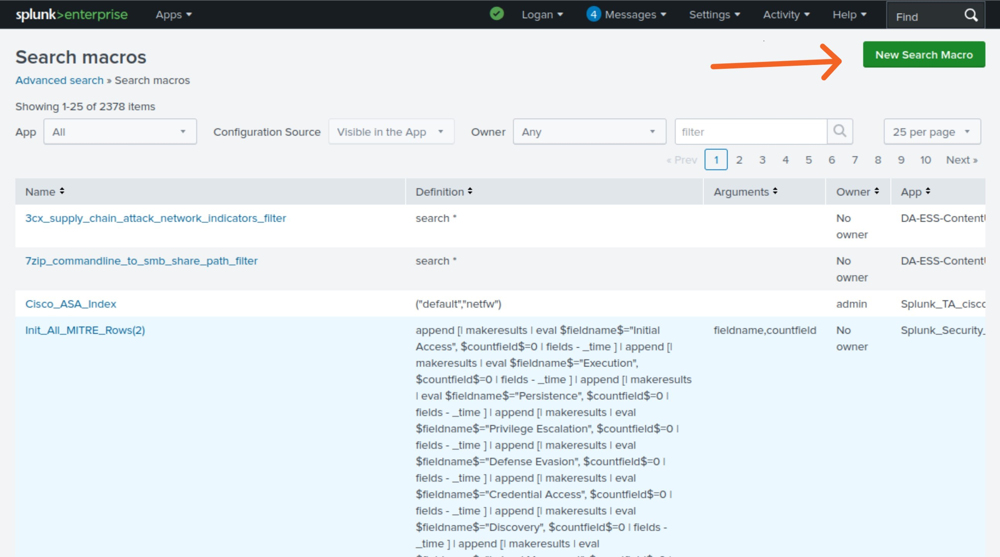
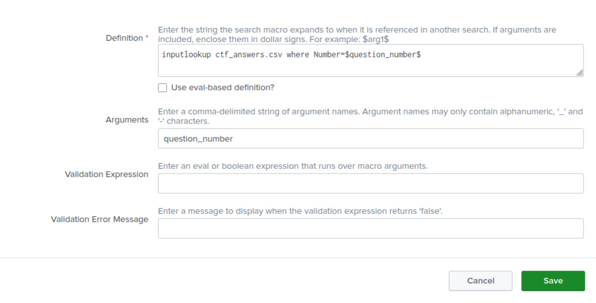
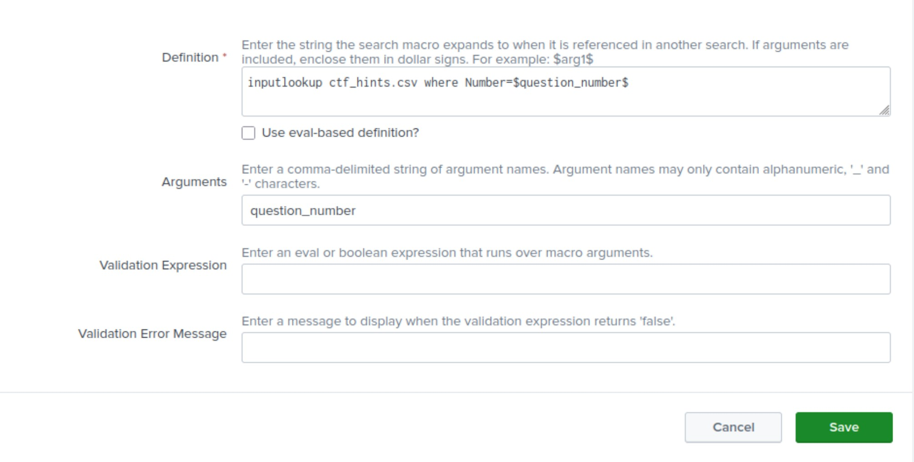
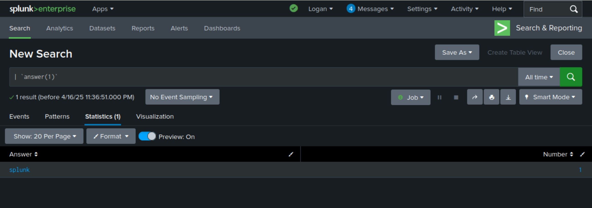
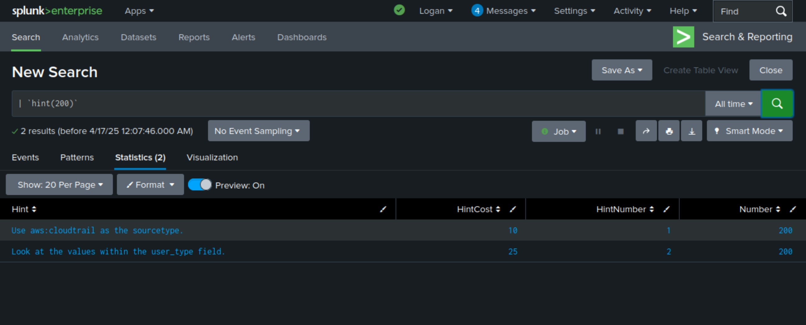

# Running Splunk in a Docker Container

## Project Overview

This is the first part of a larger project that encompasses elements of Linux, containerization, security operations center (SOC) fundamentals, and data visualization. The overall goal of this project is to run a containerized instance of Splunk in a Docker container on Linux virtual machine (VM). That instance of Splunk can then be used to ingest the Boss of the SOC (BOTS) v3 dataset and complete the capture the flag (CTF). In order to advance my data visualization skills and better analyze attack trends in the dataset, I will create security dashboards in Splunk as well.

## 1: Linux VM

The first thing I needed to do before I could begin learning how to use Docker or Splunk, was create the VM in which my project would reside. This is also where I ran into my first problem: decision fatigue. I spent far too much time considering which Linux distribution I should use, researching the pros and cons of each. Eventually, I realized that I was succumbing to paralysis by analysis and just picked Ubuntu. Creating the VM was fairly simple. In fact, Ubuntu has a very useful [step by step guide](https://ubuntu.com/tutorials/how-to-run-ubuntu-desktop-on-a-virtual-machine-using-virtualbox#1-overview) that helps new users navigate the entire process. I already had [VirtualBox](https://www.virtualbox.org/wiki/Downloads) downloaded and installed, so the only thing I needed was an [image](https://ubuntu.com/download/desktop) for Ubuntu 24.04.2 LTS. Once I had the Ubuntu image, I created my new VM and installed the OS.


## 2: Installing Docker

Now that I had a working Linux VM, I needed to install Docker. Much like Ubuntu, Docker also has a wonderful [guide](https://docs.docker.com/engine/install/ubuntu/#install-using-the-repository) to help users get Docker on their machines.

To me, the easiest way to accomplish this was to use the <code>apt</code> repository. Thanks to the Docker guide, I was able to copy and paste the requisite commands into the terminal:

1. I first needed to set up the Docker <code>apt</code> repository using the following commands:
```
# Add Docker's official GPG key:

sudo apt-get update
sudo apt-get install ca-certificates curl
sudo install -m 0755 -d /etc/apt/keyrings
sudo curl -fsSL https://download.docker.com/linux/ubuntu/gpg -o /etc/apt/keyrings/docker.asc
sudo chmod a+r /etc/apt/keyrings/docker.asc

# Add the repository to Apt sources:

echo \
  "deb [arch=$(dpkg --print-architecture) signed-by=/etc/apt/keyrings/docker.asc] https://download.docker.com/linux/ubuntu \
  $(. /etc/os-release && echo "${UBUNTU_CODENAME:-$VERSION_CODENAME}") stable" | \
  sudo tee /etc/apt/sources.list.d/docker.list > /dev/null
sudo apt-get update
```
2. Then I needed to install the latest version of the Docker packages:
```
sudo apt-get install docker-ce docker-ce-cli containerd.io docker-buildx-plugin docker-compose-plugin
```

3. Finally, I verified that the installation ws successful by running Docker's <code>hello-world</code> image:
```
sudo docker run hello-world
```
Successful running of the <code>hello-world</code> image yielded this output:

   

## 3. Setting Up Splunk

### Creating and Starting the Splunk Instance

The final step in the setup for my environment was running an instance of Splunk in a Docker container. The command I used to create my Splunk instance was:
```
sudo docker run --name splunk -p 8000:8000 \
-e "SPLUNK_PASSWORD=[password]" -e "SPLUNK_START_ARGS=--accept-license" \
-it -v splunk-data:/opt/splunk splunk/splunk:latest
```
There are a few things going on in this command:


<code>sudo</code>: This runs the command using superuser privileges.

<code>docker</code>: This used the Docker CLI to interact with Docker.

<code>run</code>: This tells Docker to create and start a new container with the image that will be specifed later.

<code>--name splunk</code>: This assigns the name <code>splunk</code> to the container, making it easier to reference in future commands.

<code>-p 8000:8000</code>: This binds port 8000 of my VM to port 8000 of the container. In the flag <code>-p x : y</code> , <code>x</code> is the port on the host machine and <code>y</code> is the port in the Docker container. This will let me access my Splunk web interface at <code>http://localhost:8000</code> in Firefox.

<code>-e "SPLUNK_PASSWORD=<password>"</code>: This sets the <code>SPLUNK_PASSWORD</code> variable inside the container. This is the password for the <code>admin</code> user in Splunk. 
_Note: If copying and pasting this command, make sure an actual password is used in this field._

<code>-e "SPLUNK_START_ARGS=--accept-license"</code>: This is sets an environment variable called <code>SPLUNK_START_ARGS</code> that will automatically accept the Splunk license, a requirement for running Splunk.

<code>-it</code>: This is a combination of the <code>-i</code> and <code>-t</code> flags that will allow for interaction with the container.

<code>-v splunk-data:/opt/splunk</code>: This mounts a named volume called <code>splunk-data</code> to the <code>/opt/splunk</code> directory on the host. There are multiple options for storage management such as bind mounts and volume mounts. Docker has [helpful documentation](https://docs.docker.com/engine/storage/) detailing the different types of storage available for containers and when to use them.

<code>splunk/splunk:latest</code>: This specifies that the official splunk image <code>splunk/splunk</code> should be used and that it should be the latest version of Splunk.

After running the container creation command, I ran this command:

```
watch -n 1 'sudo docker ps -a'
```

This allowed me to watch the progress of the container. Once it showed ```(healthy)``` in the ```STATUS``` column, I knew that I would be able to access the Splunk web interface in my browser.





### BOTS Dataset, Apps, and Add-Ons

Once my environment was setup, it was finally time to setup my Splunk to be able to complete the BOTS CTF. Splunk provides the dataset for free on the [BOTS v3 Github](https://github.com/splunk/botsv3) along with a list of all the apps and add-ons that are needed to complete the CTF. Because BOTS v3 was released over 5 years ago, some of the apps and add-ons have slightly different names, but the links provided on the BOTS v3 Github still lead to the correct apps and add-ons.

I also needed to have access to the questions, hints, and answers for the BOTS v3 CTF. Splunk provides these for anyone who emails [bots@splunk.com](mailto:bots@splunk.com). The zipped folder in which they reside can also be found [here](https://botsdataset.s3.amazonaws.com/bots_questions/botsv3content.zip).

Splunk also has two apps, a [CTF Scoreboard app](https://github.com/splunk/SA-ctf_scoreboard) and the associated [CTF Scoreboard Admin app](https://github.com/splunk/SA-ctf_scoreboard_admin), that were designed to be used in CTF competitions and provide a more gamified experience when completing the BOTS challenges. I was able to download and install the apps without any issues, but ran into a few minor issues during setup. To make a very long story short, I spent a day tinkering with the apps' Python files and configurations to no avail. Based on my limited knowledge and the Googling I did during my fruitless attempt to get the apps to work, I am assuming that the apps were designed to work with older versions of Splunk and older versions of the apps and add-ons I had installed. I eventually concluded that, while it would be fun to have the CTF Scoreboard app working correctly, I was straying a little too far from the original intent behind this project. Perhaps in the future I will revisit the challenge of getting the CTF Scoreboard app to work.

In place of the CTF Scoreboard app, I decided to instead use macros to be able to use the Splunk search app to check my answers and get hints if needed. I started by opening a bash shell as the root user inside my docker container using this command:
```
sudo docker exec -it -u 0 splunk /bin/bash
```

I used this shell to find the ```lookups``` directory in my docker container. Once I found it, I opened a new terminal window and copied the CSV files for the answers and hints into the ```lookups``` directory using this command:
```
sudo docker cp /home/logan/Desktop/cloud_splunk_project/botsv3content/botsv3content/<csv file> splunk:/opt/splunk/etc/apps/search/lookups
```

With the CSV files in the ```lookups``` directory, I could now create my search macros by going to the Splunk Web homepage and going to the "Settings" menu and navigating to "Advanced Search" under the "Knowledge" section as shown below:



I then clicked the "Search Macros" button and clicked the "New Search Macro" button in the top right corner of the screen:




I named the first macro ```answer(1)``` and set the definition as:
```
inputlookup ctf_answers.csv where Number=$question_number$
```
This takes the question number as an argument and returns that line of the answers CSV file.



I repeated the process for the hint macro naming it ```hints(1)``` and defining it as:
```
inputlookup ctf_hints.csv where Number=$question_number$
```
This takes the question number as an argument and returns all hints in the CSV file for that question.



To ensure the macros worked, I called them in the search app like this:
```
| `answer(1)`
```
and
```
| `hint(200)`
```
I knew they were working when I saw the correct rows from the CSV files returned.





## 4. The BOTS Challenge

#### Question 1
Question: This is a simple question to get you familiar with submitting answers. What is the name of the company that makes the software that you are using for this competition? Answer guidance: A six-letter word with no punctuation.

Process: This is just a sample question designed to let player know how the CTF works. 

Answer: splunk

To be continued...
