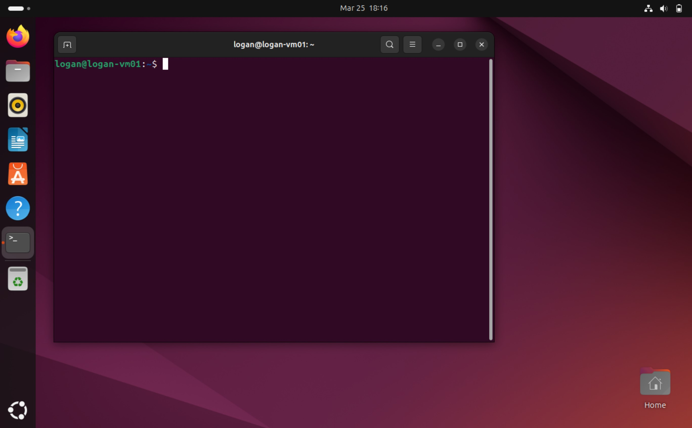
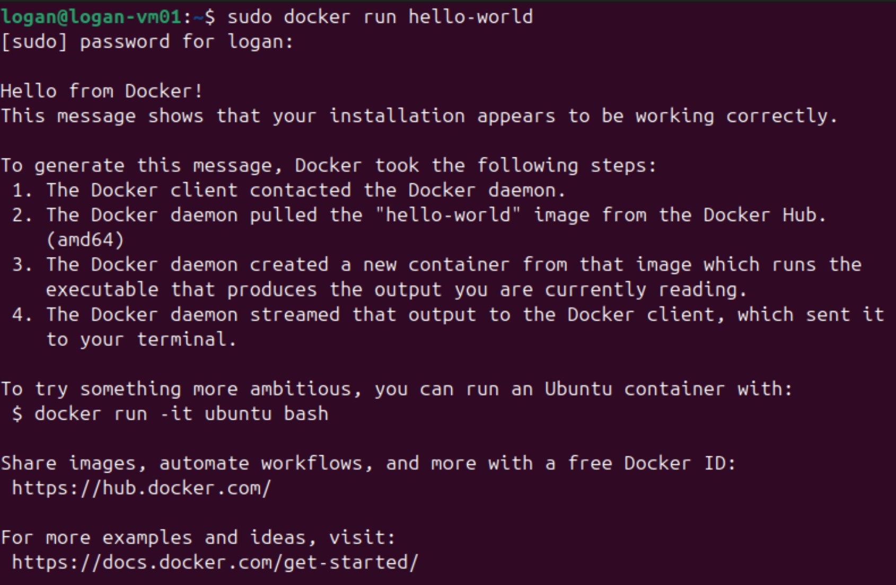

# Running Splunk in a Docker Container

## Project Overview

This is the first part of a larger project that encompasses elements of Linux, containerization, security operations center (SOC) fundamentals, and data visualization. The overall goal of this project is to run a containerized instance of Splunk in a Docker container on Linux virtual machine (VM). That instance of Splunk can then be used to ingest the Boss of the SOC (BOTS) v3 dataset and complete the capture the flag (CTF). In order to advance my data visualization skills and better analyze attack trends in the dataset, I will create security dashboards in Splunk as well.

## 1: Linux VM

The first thing I needed to do before I could begin learning how to use Docker or Splunk, was create the VM in which my project would reside. This is also where I ran into my first problem: decision fatigue. I spent far too much time considering which Linux distribution I should use, researching the pros and cons of each. Eventually, I realized that I was succumbing to paralysis by analysis and just picked Ubuntu. Creating the VM was fairly simple. In fact, Ubuntu has a very useful [step by step guide](https://ubuntu.com/tutorials/how-to-run-ubuntu-desktop-on-a-virtual-machine-using-virtualbox#1-overview) that helps new users navigate the entire process. I already had [VirtualBox](https://www.virtualbox.org/wiki/Downloads) downloaded and installed, so the only thing I needed was an [image](https://ubuntu.com/download/desktop) for Ubuntu 24.04.2 LTS. Once I had the Ubuntu image, I created my new VM and installed the OS.



## 2: Installing Docker

Now that I had a working Linux VM, I needed to install Docker. Much like Ubuntu, Docker also has a wonderful [guide](https://docs.docker.com/engine/install/ubuntu/#install-using-the-repository) to help users get Docker on their machines.

To me, the easiest way to accomplish this was to use the <code>apt</code> repository. Thanks to the Docker guide, I was able to copy and paste the requisite commands into the terminal:

1. I first needed to set up the Docker <code>apt</code> repository using the following commands:
```
# Add Docker's official GPG key:

sudo apt-get update
sudo apt-get install ca-certificates curl
sudo install -m 0755 -d /etc/apt/keyrings
sudo curl -fsSL https://download.docker.com/linux/ubuntu/gpg -o /etc/apt/keyrings/docker.asc
sudo chmod a+r /etc/apt/keyrings/docker.asc

# Add the repository to Apt sources:

echo \
  "deb [arch=$(dpkg --print-architecture) signed-by=/etc/apt/keyrings/docker.asc] https://download.docker.com/linux/ubuntu \
  $(. /etc/os-release && echo "${UBUNTU_CODENAME:-$VERSION_CODENAME}") stable" | \
  sudo tee /etc/apt/sources.list.d/docker.list > /dev/null
sudo apt-get update
```
2. Then I needed to install the latest version of the Docker packages:
```
sudo apt-get install docker-ce docker-ce-cli containerd.io docker-buildx-plugin docker-compose-plugin
```

3. Finally, I verified that the installation ws successful by running Docker's <code>hello-world</code> image:

   

## 3. Setting Up Splunk

To be continued...
